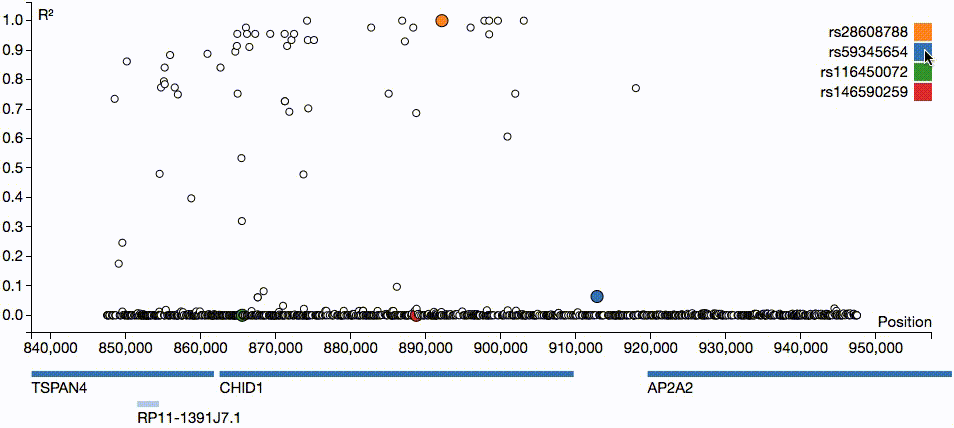

# snpbook

A proof of concept for computing linkage disequilibrium (LD) between single
nucleotide polymorphisms (SNPs) and visualizing it with [d3].

Uses [tabix] running on the [iobio] server to pull genotype data from a [VCF]
file hosted on the [BEAGLE] website.

All done in the web browser with Javascript!

[d3]: https://github.com/d3/d3
[tabix]: https://github.com/samtools/tabix
[iobio]: http://iobio.io/
[VCF]: http://www.internationalgenome.org/wiki/Analysis/vcf4.0/
[BEAGLE]: https://faculty.washington.edu/browning/beagle/beagle.html

